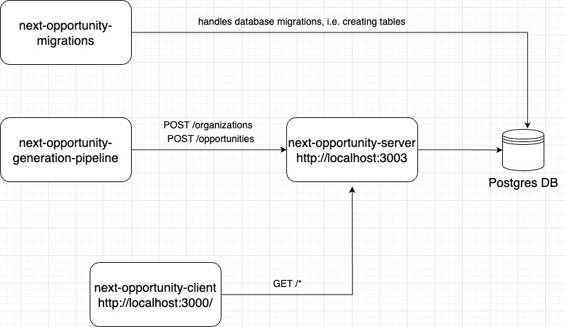

# Next Opportunity Docker

This repository Dockerizes the suite of next opportunity repositories. Those are:

- [next-opportunity-generation-pipeline](https://github.com/DanazSdiq/next-opportunity-generation-pipeline): This is the pipeline that generates opportunities

- [next-opportunity-client](https://github.com/DanazSdiq/next-opportunity-client): This is the client facing repository. Just open http://localhost:3000/opportunities locally after running `docker-compose` file

- [next-opportunity-server](https://github.com/DanazSdiq/next-opportunity-server): This is the server repository

- [next-opportunity-migrations](https://github.com/DanazSdiq/next-opportunity-migrations): This is the database migrations repository

---

## Assumptions

Only one assumption is made here and that is that you already have Docker and docker-compose installed on your machine. If you have those installed, you can easily spin up an instance locally on your machine


---

## How Do You Run This?

Clone [next-opportunity-docker](https://github.com/DanazSdiq/next-opportunity-docker) repository:

1. Open your terminal and execute this command:
    ```
    git clone https://github.com/DanazSdiq/next-opportunity-docker.git
    ```

2. Then navigate to `next-opportunity-docker` directory:
    ```
    cd next-opportunity-docker
    ```

3. Give execution permission to `clone-repos.sh` bash script to clone all the other repositories:
    ```
    sudo chmod +x ./clone-repos.sh
    ```

4. Then run `clone-repos.sh` shell script:
    ```
    ./clone-repos.sh
    ```

5. Finally, spin up all the containers
    ```
    docker-compose up
    ```

This will run a functioning version of all the apps. This might take a few minutes, please wait patiently :)

---

## How Does All of This Work?




The `next-opportunity-generation-pipeline` service basically looks for pre-defined opportunities off of the web and aggregates them. Then, these opportunities are sent to the `next-opportunity-server` where it is properly stored. This data are stored in Postgres database and `next-opportunity-migrations` service handles the creation of the necessary tables. Finally, the output of all of these services can be viewed in [http://localhost:3000/opportunities](http://localhost:3000/opportunities) locally. 

---

## Breakdown of Each Respository's Languages/Frameworks:

| Repository Name 	| Language 	| Technology/Library/Framework 	| Repository Link 	|
|---	|---	|---	|---	|
| opportunity generation pipeline 	| TypeScript 	| - 	| [link](https://github.com/DanazSdiq/next-opportunity-generation-pipeline) 	|
| server 	| TypeScript 	| Express 	| [link](https://github.com/DanazSdiq/next-opportunity-server) 	|
| client 	| TypeScript 	| React 	| [link](https://github.com/DanazSdiq/next-opportunity-client) 	|
| migrations 	| TypeScript 	| Knex 	| [link](https://github.com/DanazSdiq/next-opportunity-migrations) 	|
| docker 	| YAML 	| Docker and Docker Compose 	| [link](https://github.com/DanazSdiq/next-opportunity-docker) 	|